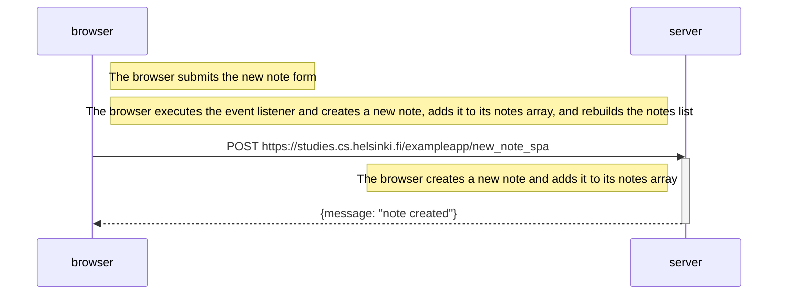

```mermaid
    sequenceDiagram
    participant browser
    participant server

        Note right of browser: The browser submits the new note form
        Note right of browser: The browser executes the event listener and creates a new note, adds it to its notes array, and rebuilds the notes list

        browser->>server: POST https://studies.cs.helsinki.fi/exampleapp/new_note_spa
        activate server
        Note left of server: The browser creates a new note and adds it to its notes array
        server-->>browser: {message: "note created"}
        deactivate server
```
